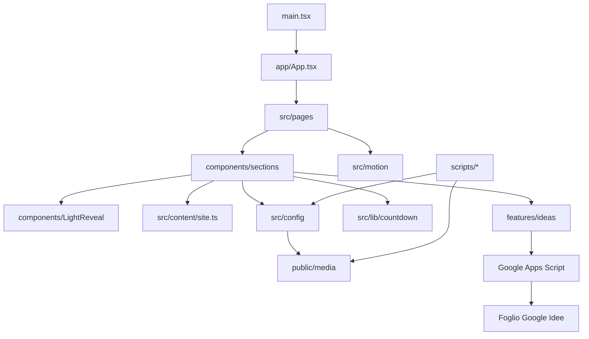

# Architettura

## Obiettivo

La landing racconta un passaggio dal buio alla luce e termina con un’azione verificabile: l’invio di un’idea al Foglio Google Lumina. L’architettura mantiene separate composizione, contenuti, movimento, media e trasporto dati.

## Cartelle

| Percorso                  | Responsabilità                                                                                        |
| ------------------------- | ----------------------------------------------------------------------------------------------------- |
| `src/app`                 | Router (`/`, `/privacy`, 404) e ritorno in cima a ogni cambio di route.                               |
| `src/pages`               | `LandingPage`, `PrivacyPage`, `NotFoundPage`: composizione, senza logica di basso livello.            |
| `src/components`          | `LightReveal.tsx`, wrapper usato dai reveal GSAP.                                                     |
| `src/components/sections` | Sezioni narrative, compresi `HeroAnimation.tsx` e `StickerSection.tsx`.                               |
| `src/content`             | `site.ts`: data delle elezioni, candidati, programma, sticker e riga finale.                          |
| `src/config`              | `heroFrames.ts` e `stickerWall.ts`, generati dagli script `media:*`. Non si modificano a mano.        |
| `src/features/ideas`      | Validazione, invio, `SubmitError` e test del client e del ricevitore Apps Script.                     |
| `src/lib`                 | `countdown.ts` e il suo test.                                                                         |
| `src/motion`              | `useLandingMotion` (Lenis, GSAP, ScrollTrigger) e `useStickerDrag` (trascinamento, con test).         |
| `src/styles`              | `index.css` (ingresso), `tokens.css` (token e font), `site.css` (reset, `.sr-only`, sezioni).         |
| `scripts`                 | Render Blender, frame dell’hero, asset degli sticker e fallback statico senza JavaScript.             |
| `assets/source`           | Sorgenti non pubblicate; origine e script consumatori in [`SOURCES.md`](../assets/source/SOURCES.md). |
| `google-apps-script`      | `Code.gs`, ricevitore del modulo da copiare nel progetto Apps Script.                                 |

## Ordine delle sezioni

`LandingPage.tsx` compone: Hero → Intro (unico `h1`) → Candidati → Countdown → Manifesto → Programma → Sticker → La tua idea → riga `.colophon` “© 2026 LUMINA · PRIVACY” con link a `/privacy`. Non ci sono navbar, menu, footer, barra di avanzamento né skip link.

## Flussi principali

### Caricamento

`main.tsx` monta React, `BrowserRouter` e `MotionConfig` con `reducedMotion="user"`, importa Poppins e gli stili. Prima di `dev` e `build`, `scripts/static-page.mjs` scrive in `index.html` una versione statica della pagina (candidati, programma e modulo nativo) visibile senza JavaScript e sostituita da React al montaggio.

`HeroAnimation` disegna su canvas la sequenza WebP renderizzata da Blender, mostrando subito il primo fotogramma; il resto della pagina resta indipendente dal media. Dettagli in [`HERO-ANIMATION.md`](HERO-ANIMATION.md).

### Scroll e movimento

`useLandingMotion` riceve il `<main>` della landing. Se il movimento non è ridotto, avvia Lenis sul ticker GSAP e crea i reveal: `.light-reveal`, candidati, proposte del programma, manifesto sticky con scrub e “attacchinaggio” degli sticker. `useGSAP` limita selettori e cleanup alla pagina; un `ResizeObserver` raggruppa i `ScrollTrigger.refresh`. Motion gestisce solo il passaggio form → conferma.

### Sticker

`StickerSection` legge `STICKER_WALL` da `src/config/stickerWall.ts` e i testi da `stickerSection` in `site.ts`. `useStickerDrag` collega i pointer event: col mouse lo sticker si prende subito, col dito dopo 300 ms di pressione, da tastiera si sposta con le frecce (16 px, 48 px con Shift). Gli spostamenti sono salvati in frazioni della sezione, così sopravvivono al resize, e si azzerano ricaricando la pagina o passando tra layout mobile e desktop.

### Idee

`IdeaSection` valida i dati, genera un UUID (con fallback su `crypto.getRandomValues` fuori dai contesti sicuri) e chiama `submitIdea`. Il client accetta il successo solo quando Apps Script restituisce lo stesso UUID. Gli errori arrivano come `SubmitError` con messaggi in italiano; dopo l’invio il focus passa al titolo della conferma. Dettagli in [`FORM-AND-DATA.md`](FORM-AND-DATA.md).
