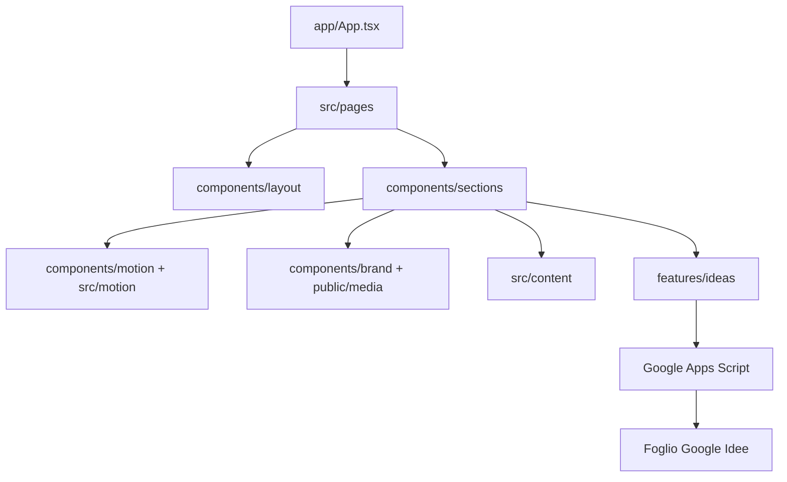

# Architettura

## Obiettivo

La landing racconta un passaggio dal buio alla luce e termina con un’azione verificabile: l’invio di un’idea al Foglio Google Lumina. L’architettura mantiene separate composizione, contenuti, movimento, media e trasporto dati.

## Cartelle

| Percorso                  | Responsabilità                                            |
| ------------------------- | --------------------------------------------------------- |
| `src/app`                 | Router e comportamento condiviso tra le route.            |
| `src/pages`               | Composizione delle pagine, senza logica di basso livello. |
| `src/components/layout`   | Header, footer e cornice desktop.                         |
| `src/components/sections` | Sezioni narrative della landing.                          |
| `src/components/brand`    | Logo, animazione dell’header e relativi fallback.         |
| `src/features/ideas`      | Validazione, invio e test del modulo.                     |
| `src/content`             | Dati editoriali provvisori e navigazione.                 |
| `src/styles`              | Token e stile globale.                                    |

## Flussi principali

### Caricamento

`main.tsx` monta React, Router e `MotionConfig`. `HeroAnimation` disegna su canvas la sequenza WebP renderizzata da Blender, mostrando subito il primo fotogramma; il resto della pagina rimane indipendente dal media.

### Movimento

`useLandingMotion` integra Lenis e ScrollTrigger. Le animazioni GSAP sono limitate alla pagina e vengono eliminate automaticamente da `useGSAP`; Motion gestisce menu, galleria e stato del form.

### Idee

`IdeaSection` valida i dati, genera un UUID e chiama `submitIdea`. Il client accetta il successo solo quando Apps Script restituisce lo stesso UUID, così una risposta generica non può produrre un falso positivo.
